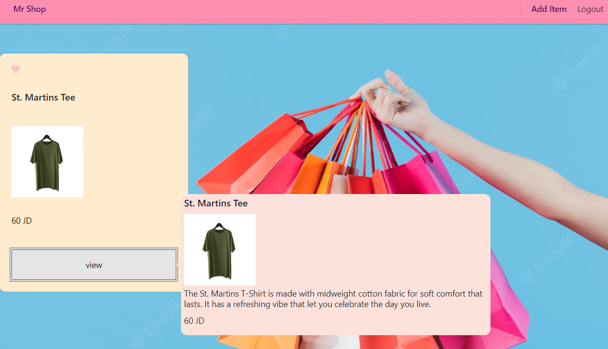
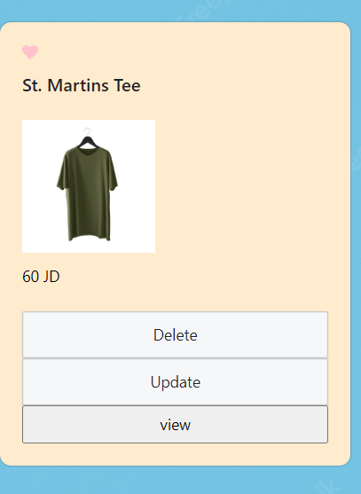

# MR.Shop

An online shopping portal for a fictional store

# LIVE
[LiveURL](https://alsatarysamah.github.io/online-shopping/)

# Example

# Business Requirements

Our application will power an online storefront that will allow our users to add ,upsate and delet items,add it  their favaourit list and place items in their shopping cart.

# Technical Requirements

The application will be created with the following overall architecture and methodologies

React

ES6 Classes

useContext hook for Application State

Deployed API with sql storage for storing item and user

Superagent and Axios for performing API Requests

Material UI for layout and styling

Deployment to a cloud provider ( GitHub Pages)
